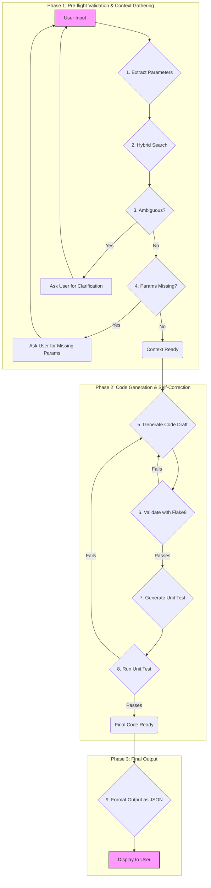

# AI Code Generation Agent: Documentation

## 1. Overview

This system is an advanced AI agent designed to generate Python code based on natural language instructions. It leverages a knowledge graph (Neo4j) and a vector database (ChromaDB) to understand the user's intent and generate high-quality, validated code.

The agent's key capabilities include:
- **Hybrid Search:** Combines semantic search and graph traversal for accurate information retrieval.
- **Interactive Dialogue:** Asks clarifying questions when the user's request is ambiguous or incomplete.
- **Self-Correction:** Automatically validates its own code using static analysis (`flake8`) and dynamic unit testing, and attempts to fix any issues it finds.
- **Structured Output:** Provides its final answer in a reliable JSON format.

## 2. Directory Structure

The core logic is located in the `code_generator/` directory.

- `main.py`: The main entry point to start the interactive chat application.
- `agent.py`: Defines the core agent, its reasoning logic (system prompt), and the tools it uses.
- `tools.py`: Implements the custom tools the agent can use (e.g., for searching, code validation).
- `schemas.py`: Defines the Pydantic models for structured data (e.g., the agent's final answer).
- `db/ingest_to_chroma.py`: A script to prepare the vector database from the Neo4j graph.
- `rerank_feature/reranker.py`: An optional, unimplemented module for improving search results.
- `tests/`: Contains all unit and integration tests for the system.

## 3. Setup and Installation

### Step 3.1: Environment Variables

Create a `.env` file in the project's root directory. This file must contain the credentials for the services the agent uses.

```env
# Neo4j Database Credentials
NEO4J_URI="bolt://localhost:7687"
NEO4J_USER="neo4j"
NEO4J_PASSWORD="your_neo4j_password"
NEO4J_DATABASE="neo4j" # Or your specific database name

# OpenAI API Key
OPENAI_API_KEY="sk-..."
```

### Step 3.2: Install Dependencies

Install all required Python libraries from `requirements.txt`.

```bash
pip install -r requirements.txt
```

## 4. Running the System

### Step 4.1: Data Preparation (One-time Setup)

Before running the agent for the first time, you must populate the ChromaDB vector store. This script reads from your Neo4j graph and creates the vector index needed for semantic search.

Run the following command from the project root directory:

```bash
python -m code_generator.db.ingest_to_chroma
```

This will create a `chroma_db_store/` directory in your project root containing the vector database.

### Step 4.2: Start the Agent

To start the interactive chat assistant, run the `main.py` script:

```bash
python code_generator/main.py
```

You can then provide instructions in Japanese, for example: "一辺が50mmの正方形のキューブを作成してください".

## 5. Running Tests

To verify that all components are working correctly, you can run the test suite. The tests are designed to run without needing live API keys (they use mocks).

Run the following command from the project root directory:

```bash
python -m unittest discover code_generator/tests
```

## 6. System Workflow (Mermaid Diagram)

The agent follows a sophisticated workflow to ensure the quality of its output. The diagram below illustrates this process.



## 7. How to Modify and Extend

- **To change the agent's core behavior:** The main logic is defined by the system prompt in `code_generator/agent.py`. Modifying this prompt is the primary way to change the agent's workflow.
- **To add a new tool:**
    1.  Implement a new `BaseTool` subclass in `code_generator/tools.py`.
    2.  Add an instance of your new tool to the `tools` list in `code_generator/agent.py`.
    3.  Update the agent's system prompt to instruct it on how and when to use the new tool.
