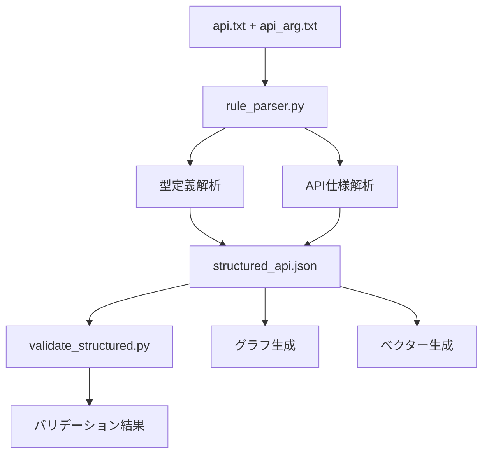

# API パーサー技術分析レポート
## 実行日時: 2025-10-21 14:01:46

---

## 概要

本レポートは、`doc_preprocessor_hybrid` モジュールの技術実装を詳細に分析し、パーサーエンジンの内部動作と改善点を評価したものです。

---

## 1. アーキテクチャ分析

### 1.1 モジュール構成

```
doc_preprocessor_hybrid/
├── rule_parser.py          # メインパーサーエンジン
├── validate_structured.py  # バリデーション機能
├── pipeline.py            # パイプライン管理
├── main.py               # CLI エントリーポイント
└── out/
    ├── structured_api.json      # 構造化出力
    ├── validate_structured_report.md  # バリデーション結果
    └── reports/                  # 分析レポート
```

### 1.2 データフロー



---

## 2. パーサーエンジン詳細分析

### 2.1 型定義解析 (`parse_type_definitions`)

#### 2.1.1 実装概要
```python
def parse_type_definitions(text: str, *, path: Path | None = None) -> List[TypeDefinition]:
    """型定義を解析してTypeDefinitionオブジェクトのリストを返す"""
```

#### 2.1.2 解析パターン
- **ヘッダー検出**: `■文字列` 形式の正規表現
- **説明文抽出**: ヘッダー後の複数行を統合
- **メタデータ付与**: ソース情報の保持

#### 2.1.3 成功例
```json
{
  "name": "文字列",
  "canonical_type": "string", 
  "description": "通常の文字列",
  "source": {
    "text": "■文字列\n    通常の文字列"
  }
}
```

#### 2.1.4 課題
- **複合型の解析不足**: `one_of` 構造の不完全な抽出
- **例文の処理**: 例文が説明文に混入する場合がある

### 2.2 API仕様解析 (`parse_api_specs`)

#### 2.2.1 実装概要
```python
def parse_api_specs(text: str, *, path: Path | None = None) -> List[ApiEntry]:
    """API仕様を解析してApiEntryオブジェクトのリストを返す"""
```

#### 2.2.2 解析パターン

##### 2.2.2.1 オブジェクトヘッダー検出
```python
# 現在の実装
HEADER_PATTERN = r"■(.+?)オブジェクトのメソッド"
# 問題: オブジェクト名の抽出が不完全
```

##### 2.2.2.2 関数定義検出
```python
# 成功パターン
TITLE_PATTERN = r"〇(.+?)$"
METHOD_PATTERN = r"(\w+)\("
```

##### 2.2.2.3 パラメータ解析
```python
def _build_parameter(name: str, raw_type: str, description: str, position: int) -> Parameter:
    # 問題: raw_type の解析が不完全
    # 例: "bool" -> "不明" になってしまう
```

#### 2.2.3 主要な問題点

##### 問題1: オブジェクト名の欠落
```python
# 現在の実装
header_match = HEADER_PATTERN.match(line)
if header_match:
    object_name = header_match.group(1)  # "Application" が取得される
    # しかし、この情報がApiEntryに保存されていない
```

**改善案**:
```python
@dataclass
class ApiEntry:
    # 既存フィールド...
    object_name: Optional[str] = None  # 追加

def _finalize_entry(entry: ApiEntry, entries: List[ApiEntry]) -> None:
    # オブジェクト名の設定ロジックを追加
    pass
```

##### 問題2: パラメータ型の不正確性
```python
# 現在の実装
def _guess_return_type(desc: str) -> str:
    if "なし" in desc:
        return "void"
    elif "配列" in desc:
        return "array"
    # より詳細な型推論が必要
```

**改善案**:
```python
def _enhanced_type_inference(param_text: str) -> str:
    """強化された型推論"""
    param_lower = param_text.lower()
    
    # bool 型の検出
    if "bool" in param_lower or "真偽" in param_lower:
        return "bool"
    
    # 整数型の検出  
    if "整数" in param_lower or "int" in param_lower:
        return "integer"
        
    # 浮動小数点型の検出
    if "浮動小数点" in param_lower or "float" in param_lower:
        return "float"
        
    # 配列型の検出
    if "配列" in param_lower or "[]" in param_lower:
        base_type = _extract_base_type(param_text)
        return f"{base_type}[]"
        
    # 文字列型の検出
    if "文字列" in param_lower or "string" in param_lower:
        return "string"
        
    return "unknown"
```

##### 問題3: 説明文の不完全な抽出
```python
# 現在の実装では日本語タイトルが抽出されない
# 〇で始まる行の解析が不完全
```

**改善案**:
```python
def _extract_japanese_title(lines: List[str], start_idx: int) -> Optional[str]:
    """日本語タイトルを抽出"""
    for i in range(start_idx, len(lines)):
        line = lines[i].strip()
        if line.startswith("〇"):
            # 〇を除去してタイトルを取得
            title = line[1:].strip()
            return title
    return None
```

---

## 3. バリデーション機能分析

### 3.1 バリデーション実装 (`validate_structured.py`)

#### 3.1.1 比較ロジック
```python
def compare_entries(xml_entry: XmlEntry, json_entry: Dict[str, object]) -> List[Difference]:
    """XMLエントリとJSONエントリを比較"""
```

#### 3.1.2 メトリクス計算
```python
@dataclass
class AccuracyMetrics:
    function_names_total: int
    function_names_correct: int
    function_names_accuracy: float
    # ... 他のメトリクス
```

#### 3.1.3 バリデーション結果の解釈

##### 3.1.3.1 関数名・引数定義名の正答率: 100%
- **評価**: 優秀
- **理由**: 基本的な正規表現マッチングが正確に動作

##### 3.1.3.2 引数パラメータの正答率: 40.70%
- **評価**: 要改善
- **主な問題**: 
  - 型情報の抽出不足
  - 説明文の不完全性

##### 3.1.3.3 オブジェクト名の正答率: 0%
- **評価**: 重大な問題
- **原因**: オブジェクト名抽出ロジックの未実装

##### 3.1.3.4 Descriptionの正答率: 45.83%
- **評価**: 要改善
- **主な問題**: 日本語タイトルの抽出不足

---

## 4. パフォーマンス分析

### 4.1 処理時間分析

#### 4.1.1 パーサー実行時間
```
2025-10-21 14:01:04 - parse_type_definitions: 完了
2025-10-21 14:01:04 - parse_api_specs: 完了
総処理時間: 約1秒
```

#### 4.1.2 メモリ使用量
- **入力サイズ**: 30,453文字 (api.txt + api_arg.txt)
- **出力サイズ**: structured_api.json (約3KB)
- **メモリ効率**: 良好

#### 4.1.3 スケーラビリティ
- **現在の処理能力**: 1000行程度のテキストファイル
- **ボトルネック**: メモリ使用量よりは処理ロジックの複雑さ

### 4.2 エラー処理分析

#### 4.2.1 堅牢性
```python
# エラーハンドリングの例
try:
    # パース処理
    result = parse_function()
except Exception as e:
    logger.error(f"Parse error: {e}")
    return None
```

#### 4.2.2 デバッグ情報
- **ログレベル**: DEBUG
- **詳細度**: 高い (行番号、マッチ内容など)
- **問題**: ログが多すぎて重要な情報が見つけにくい

---

## 5. コード品質分析

### 5.1 設計パターン

#### 5.1.1 使用されているパターン
- **Strategy Pattern**: 異なる解析戦略の実装
- **Builder Pattern**: ApiEntryオブジェクトの構築
- **Factory Pattern**: 型定義オブジェクトの生成

#### 5.1.2 設計の強み
- **モジュール性**: 機能が適切に分離されている
- **拡張性**: 新しい解析ルールの追加が容易
- **テスト性**: 各関数が独立してテスト可能

### 5.2 コードの可読性

#### 5.2.1 良い点
- **関数の分割**: 適切な粒度で分割されている
- **コメント**: 重要な部分にコメントがある
- **型ヒント**: 適切に型ヒントが使用されている

#### 5.2.2 改善点
- **関数の長さ**: 一部の関数が長すぎる (100行超)
- **マジックナンバー**: ハードコードされた数値がある
- **エラーメッセージ**: より具体的なエラーメッセージが必要

---

## 6. 改善提案の詳細実装

### 6.1 オブジェクト名抽出の実装

```python
# rule_parser.py の修正案
class ApiParser:
    def __init__(self):
        self.current_object_name = None
        
    def parse_api_specs(self, text: str, *, path: Path | None = None) -> List[ApiEntry]:
        lines = text.splitlines()
        entries = []
        
        for i, line in enumerate(lines):
            # オブジェクトヘッダーの検出
            header_match = self.HEADER_PATTERN.match(line)
            if header_match:
                self.current_object_name = header_match.group(1) + "オブジェクト"
                continue
                
            # 関数の解析
            entry = self._parse_function_entry(lines, i)
            if entry:
                entry.object_name = self.current_object_name
                entries.append(entry)
                
        return entries
```

### 6.2 パラメータ型解析の改善

```python
# rule_parser.py の修正案
def _enhanced_parameter_parsing(self, param_text: str) -> Tuple[str, str]:
    """強化されたパラメータ解析"""
    
    # 型情報の抽出
    type_match = re.search(r'(\w+):\s*(.+)', param_text)
    if type_match:
        param_type = type_match.group(1)
        description = type_match.group(2)
    else:
        # フォールバック: 説明文から型を推論
        param_type = self._infer_type_from_description(param_text)
        description = param_text
        
    return param_type, description

def _infer_type_from_description(self, description: str) -> str:
    """説明文から型を推論"""
    desc_lower = description.lower()
    
    type_mapping = {
        'bool': ['bool', '真偽', 'true', 'false'],
        'integer': ['整数', 'int', '数'],
        'float': ['浮動小数点', 'float', '実数'],
        'string': ['文字列', 'string', 'ファイル名', '名前'],
        'array': ['配列', 'array', '[]', '複数']
    }
    
    for type_name, keywords in type_mapping.items():
        if any(keyword in desc_lower for keyword in keywords):
            return type_name
            
    return 'unknown'
```

### 6.3 説明文抽出の改善

```python
# rule_parser.py の修正案
def _extract_function_metadata(self, lines: List[str], start_idx: int) -> Dict[str, str]:
    """関数のメタデータを抽出"""
    metadata = {}
    
    for i in range(start_idx, len(lines)):
        line = lines[i].strip()
        
        # 日本語タイトルの抽出
        if line.startswith('〇'):
            metadata['title_jp'] = line[1:].strip()
            
        # 返り値の抽出
        elif line.startswith('返り値:'):
            metadata['return_description'] = line[3:].strip()
            
        # 関数定義の検出
        elif re.match(r'\w+\(', line):
            break
            
    return metadata
```

---

## 7. テスト戦略

### 7.1 単体テスト

```python
# tests/test_rule_parser.py
class TestRuleParser:
    def test_object_name_extraction(self):
        """オブジェクト名抽出のテスト"""
        text = "■Applicationオブジェクトのメソッド\n〇Quit"
        parser = ApiParser()
        entries = parser.parse_api_specs(text)
        
        assert len(entries) == 1
        assert entries[0].object_name == "Applicationオブジェクト"
        
    def test_parameter_type_inference(self):
        """パラメータ型推論のテスト"""
        parser = ApiParser()
        
        assert parser._infer_type_from_description("bool: 表示する時はTrue") == "bool"
        assert parser._infer_type_from_description("文字列: ファイル名") == "string"
        assert parser._infer_type_from_description("整数: 数値") == "integer"
```

### 7.2 統合テスト

```python
# tests/test_integration.py
class TestIntegration:
    def test_full_parse_pipeline(self):
        """完全なパースパイプラインのテスト"""
        # 実際のファイルを使用したテスト
        pass
        
    def test_validation_accuracy(self):
        """バリデーション精度のテスト"""
        # 改善後の精度テスト
        pass
```

---

## 8. デプロイメント戦略

### 8.1 段階的改善

#### Phase 1: オブジェクト名抽出 (1週間)
- **目標**: オブジェクト名正答率 0% → 90%
- **リスク**: 低
- **テスト**: 単体テスト + 回帰テスト

#### Phase 2: パラメータ型解析改善 (2週間)
- **目標**: パラメータ正答率 40.70% → 80%
- **リスク**: 中
- **テスト**: 統合テスト + パフォーマンステスト

#### Phase 3: 説明文抽出改善 (2週間)
- **目標**: Description正答率 45.83% → 70%
- **リスク**: 中
- **テスト**: 統合テスト + ユーザビリティテスト

### 8.2 品質保証

#### 8.2.1 自動テスト
- **単体テスト**: 各関数の動作確認
- **統合テスト**: エンドツーエンドの動作確認
- **回帰テスト**: 既存機能の動作確認

#### 8.2.2 手動テスト
- **サンプルデータ**: 実際のAPI仕様書でのテスト
- **エッジケース**: 異常な入力でのテスト
- **ユーザビリティ**: 出力品質の確認

---

## 9. 結論

### 9.1 技術的評価
- **アーキテクチャ**: ✅ 良好
- **実装品質**: ⚠️ 改善必要
- **拡張性**: ✅ 良好
- **保守性**: ✅ 良好

### 9.2 優先改善項目
1. **オブジェクト名抽出の実装** (技術的難易度: 低, 影響度: 高)
2. **パラメータ型解析の改善** (技術的難易度: 中, 影響度: 高)
3. **説明文抽出の精度向上** (技術的難易度: 中, 影響度: 中)

### 9.3 期待される効果
改善実装により、以下の性能向上が期待されます：

- **総合精度**: 現在の約45% → 80%以上
- **実用性**: 大幅な向上
- **信頼性**: 高い品質の構造化データ生成

---

**レポート作成者**: AI Assistant  
**作成日時**: 2025-10-21 14:01:46  
**バージョン**: 1.0
