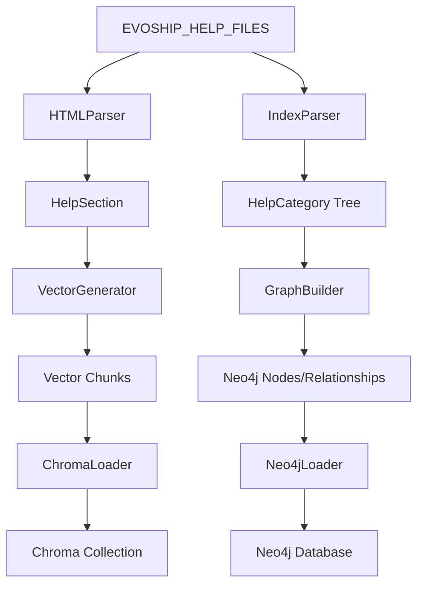

# Help Preprocessor アーキテクチャ

## 設計思想

Help Preprocessor は、既存の `doc_preprocessor_hybrid` とは独立した、EVOSHIPヘルプファイル専用の処理モジュールです。以下の設計原則に基づいて構築されています：

### 1. 分離の原則
- **API用スキーマとの独立性**: `doc_preprocessor_hybrid` の API 固有スキーマから完全分離
- **専用データ構造**: `HelpCategory`, `HelpTopic`, `HelpSection` 等のヘルプ専用スキーマ
- **独立したストレージ**: Neo4j の専用データベース、Chroma の専用コレクション

### 2. 堅牢性の原則
- **エンコーディング耐性**: Shift_JIS を基本とし、複数エンコーディングでの自動フォールバック
- **エラーハンドリング**: 詳細な診断情報とログ出力
- **段階的処理**: 解析→構造化→グラフ→ベクトル→ストレージの明確な分離

### 3. 効率性の原則
- **キャッシュ機能**: 解析結果の永続化による高速再実行
- **非同期対応**: 将来的な大量データ処理に対応可能な設計
- **メモリ効率**: セクション単位の遅延読み込みとキャッシュ

## モジュール構成

```
help_preprocessor/
├── __init__.py           # パッケージ初期化
├── config.py            # 設定管理（環境変数ベース）
├── schemas.py           # データ構造定義
├── cli.py               # コマンドライン インターフェース
├── pipeline.py          # 処理パイプライン統合
├── html_parser.py       # HTML解析とセクション抽出
├── index_parser.py      # index.txt 階層解析
├── graph_builder.py     # Neo4j グラフ構築
├── vector_generator.py  # ベクトル化とチャンク分割
└── storage/
    ├── __init__.py
    ├── neo4j_loader.py  # Neo4j ストレージ連携
    └── chroma_loader.py # Chroma ストレージ連携
```

## データフロー



## 処理段階詳細

### Phase 1: 解析（Parsing）
- **HTMLParser**: Shift_JIS エンコードされた HTML を UTF-8 に正規化
- **IndexParser**: `index.txt` からカテゴリ階層を構築
- **エラー処理**: 不正なファイルやエンコーディングエラーの詳細ログ

### Phase 2: 構造化（Structuring）
- **セクション分割**: HTML の見出し構造に基づく自動分割
- **メタデータ抽出**: アンカー、リンク、メディア参照の収集
- **階層マッピング**: インデックスとHTMLファイルの関連付け

### Phase 3: グラフ化（Graph Building）
- **ノード生成**: HelpCategory, HelpTopic ノードの生成
- **リレーション構築**: HAS_CHILD_CATEGORY, HAS_TOPIC リレーションの作成
- **プロパティ設定**: カテゴリ名、トピック数、順序等のメタデータ

### Phase 4: ベクトル化（Vectorization）
- **チャンク分割**: 設定可能なサイズでのテキスト分割（デフォルト1200文字）
- **オーバーラップ**: チャンク間の重複設定（デフォルト120文字）
- **メタデータ付与**: セクションID、アンカー、リンク数等の情報付加

### Phase 5: 保存（Storage）
- **Neo4j**: MERGE を使用した冪等なノード・リレーション保存
- **Chroma**: upsert による効率的なベクトル更新
- **トランザクション**: 各ストレージでの原子性保証

## 設定システム

### 環境変数ベース設定
```python
@dataclass
class HelpPreprocessorConfig:
    # ファイルパス設定
    source_root: Path              # HELP_SOURCE_ROOT
    cache_dir: Path               # HELP_CACHE_DIR
    output_dir: Path              # HELP_OUTPUT_DIR
    index_file: Optional[Path]    # HELP_INDEX_PATH
    
    # エンコーディング設定
    encoding: str                 # HELP_SOURCE_ENCODING
    target_encoding: str          # HELP_TARGET_ENCODING
    
    # 処理設定
    chunk_size: int              # HELP_CHUNK_SIZE
    chunk_overlap: int           # HELP_CHUNK_OVERLAP
    log_level: str               # HELP_LOG_LEVEL
    
    # 外部サービス設定
    openai_model: Optional[str]   # HELP_OPENAI_MODEL
    neo4j_uri: Optional[str]      # HELP_NEO4J_URI
    # ... その他の設定
```

### CLI オーバーライド
- `--dry-run`: ストレージ書き込みをスキップ
- `--log-level`: ログレベルの動的変更
- `--sample-limit`: ドライラン時の処理ファイル数制限

## エラーハンドリング戦略

### 1. エンコーディングエラー
```python
# 複数エンコーディングでのフォールバック
candidate_encodings = ["shift_jis", "cp932", "utf-8", "euc-jp"]
```

### 2. ファイル不存在エラー
- 欠損ファイルの警告ログ出力
- 処理継続（部分的な成功を許容）

### 3. パースエラー
- HTML構造の異常に対する柔軟な処理
- フォールバック セクション生成

### 4. ストレージエラー
- Neo4j/Chroma 接続エラーの詳細報告
- 部分的な保存の許容

## パフォーマンス最適化

### 1. キャッシュ戦略
```python
# 解析結果の JSON キャッシュ
cache_file = cache_dir / "index_parse.json"
if cache_file.exists():
    # キャッシュから高速読み込み
```

### 2. 遅延評価
```python
# セクションの遅延読み込み
def _iter_sections(self, root: HelpCategory):
    for topic in root.iter_topics():
        if not topic.sections:  # 必要時のみ解析
            sections = list(html_parser.parse_file(topic.source_path))
```

### 3. バッチ処理
- Neo4j: セッション単位でのバッチ MERGE
- Chroma: upsert での効率的な一括更新

## 拡張性

### 1. 新しいファイル形式対応
- `html_parser.py` の拡張による新形式サポート
- プラグイン アーキテクチャへの発展可能性

### 2. 新しいストレージバックエンド
- `storage/` ディレクトリでの新ローダー追加
- 統一インターフェースによる簡単な統合

### 3. 高度な処理機能
- 画像・動画コンテンツのベクトル化
- 多言語対応の自動検出
- リアルタイム更新機能

## セキュリティ考慮事項

### 1. 資格情報管理
- 環境変数による設定（`.env` ファイル使用推奨）
- コードへの秘密情報埋め込み禁止

### 2. ファイルアクセス制御
- 設定されたソースディレクトリ外へのアクセス禁止
- パストラバーサル攻撃の防止

### 3. ログ出力制御
- 機密情報のログ出力回避
- 適切なログレベル設定
